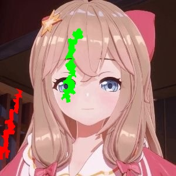

# Lazy Snapping by Python

This git include python code based on <code>numpy,cv2,scipy,argparse</code> to realize image snapping by Poisson method. 

For an example, if you want to choose some area from <code>image.jpg</code> like


and choose the area like 


you can run the code by: 

```bash
python mouse.py -i image.jpg
```

then put mouse on area you want, press <code>f</code> and move mouse. When you want to stop, press n. Then put mouse on area you don't want, press <code>b</code> and move mouse. When you want to stop, just press n. Finally press <code>enter</code> when you think you've already choose the area. 

Example above follows the pen path like: 



Blue path means want and green path means don't want. 