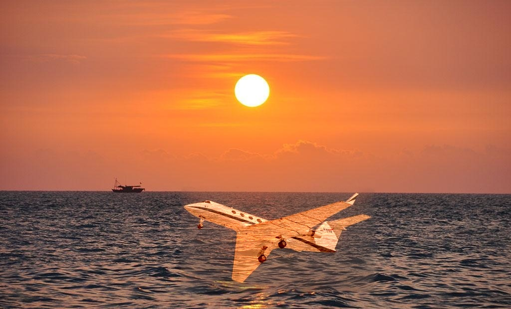

# Poisson Editing by Python

This git include python code based on <code>numpy,cv2,scipy,argparse</code> to realize image fusion by Poisson method. 

For an example, if you want to take background image from <code>dst.jpg</code> and front image from <code>src.jpg</code>, then mixed them at [556,480] with k=0.6 and save at result.jpg, you can run this code: 

```bash
python poisson.py \
-x 556 \
-y 480 \
-b dst.jpg \
-f src.jpg \
-m "mixed" \
-k 0.6 \
-s "result.jpg"
```

Then, you can see this image: 

